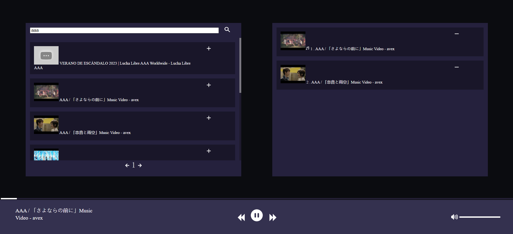

Simple music website using YouTube API.
Function:
- One room per domain --> Listen to music together (customable).
- Search track and playlist through name and link.
- Navigation through scrollbar and pages.
- Add, remove track.
- Add, remove playlist.
- Play, pause.
- Next track, previous track.
- Volume control, volume button's interaction.
- Display search's list, track's list.

Required: 
- YouTube API's key: https://console.cloud.google.com/apis/.

Set up:
- Change ".env.example" into ".env" and type in your own key.
- pnpm install

Start:
- pnpm run dev

Implement:
- YouTube API. Documents: https://developers.google.com/youtube/v3/docs
